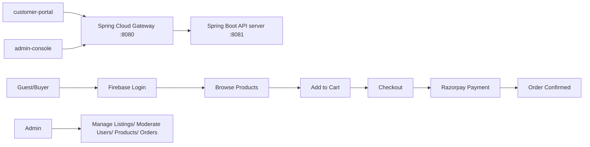

# Fresh Greens

Fresh Greens is a B2C e-commerce platform for fresh produce, built with Spring Boot.
It supports customer/admin journeys, Firebase-based authentication, cart + checkout, and Razorpay payments.

All frontend API traffic is routed through Spring Cloud Gateway.

## Valid Frontend Applications

Only these frontend applications are valid in this project:

- customer-portal
- admin-console

## Quick Visual

## Core Features

- Firebase token authentication + Spring Security session flow
- Product listing, search, and category browsing
- Customer cart management and order placement
- Razorpay order creation + payment verification
- Admin listing management (create/update/delete)
- Admin APIs for stats, users, products, and orders
- Redis/in-memory caching for fast reads

## Tech Stack

- Java 17, Spring Boot
- Spring Cloud Gateway
- Spring Security, Spring Data JPA, MySQL
- Firebase Admin SDK
- Razorpay Java SDK
- Redis (optional; fallback in-memory cache)
- Static frontend (HTML/CSS/JS)

## Project Structure

- server/src/main/java/com/freshgreens/app/config → security, firebase, cache, redis, razorpay
- server/src/main/java/com/freshgreens/app/controller → auth/cart/product/order/user/admin/webhook APIs
- server/src/main/java/com/freshgreens/app/dto → request/response contracts
- server/src/main/java/com/freshgreens/app/service → business logic
- server/src/main/java/com/freshgreens/app/repository → data access
- server/src/main/java/com/freshgreens/app/model → entities
- gateway/src/main/java/com/freshgreens/gateway → Spring Cloud API gateway
- customer-portal → customer-facing React web app
- admin-console → admin-facing React web app
- server/src/main/resources/static → frontend pages/assets
- .mermaid → architecture/flow diagrams

## Run Locally

### 1) Prerequisites

- Java 17+
- MySQL 8+
- Maven wrapper (already included)
- (Optional) Redis

### 2) Configure environment

Set the following values (system env or `.env`-style injection):

- `DB_URL`
- `DB_USERNAME`
- `DB_PASSWORD`
- `RAZORPAY_KEY_ID`
- `RAZORPAY_KEY_SECRET`
- `RAZORPAY_WEBHOOK_SECRET` (optional)
- `APP_FIREBASE_CONFIG_PATH` (defaults to `firebase-service-account.json`)

### 3) Start backend server (port 8081)

From the server folder:

- Windows: `mvnw.cmd spring-boot:run`
- macOS/Linux: `./mvnw spring-boot:run`

- Activate with (PowerShell):   `$env:SPRING_PROFILES_ACTIVE='local'; .\mvnw.cmd spring-boot:run`
- Activate with (bash):         `SPRING_PROFILES_ACTIVE=local ./mvnw spring-boot:run`

Server URL: `http://localhost:8081`

### 4) Start API gateway (port 8080)

From the gateway folder:

- Windows: `mvnw.cmd spring-boot:run` (if wrapper exists), or `mvn spring-boot:run`
- macOS/Linux: `./mvnw spring-boot:run` (if wrapper exists), or `mvn spring-boot:run`

Gateway URL (frontend API target): `http://localhost:8080`

## Useful Endpoints

- Home: `/`
- Swagger UI: `/swagger-ui.html`
- Health: `/actuator/health`
- Auth: `/api/auth/*`
- Products: `/api/products/*`
- Cart: `/api/cart/*`
- Orders: `/api/orders/*`
- Admin: `/api/admin/*`