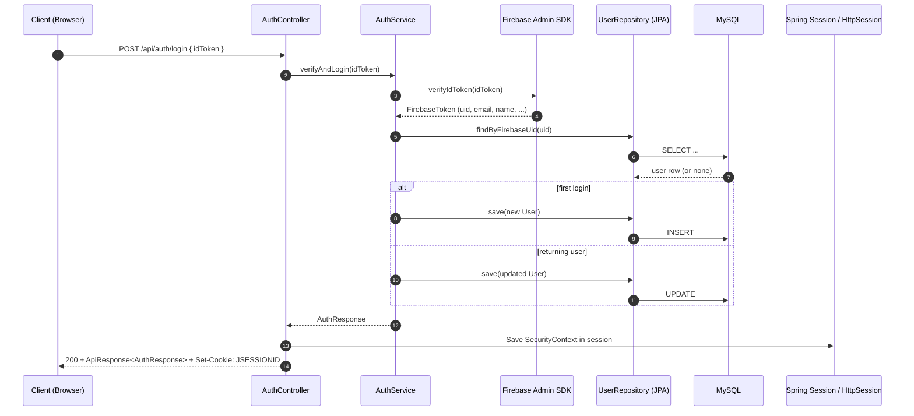
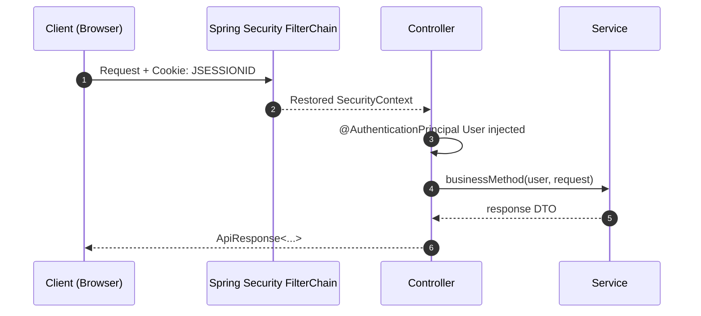

---

# Fresh Greens — Layered Data & Configuration Flow

This document explains **how data is configured and transferred across layers** in this codebase.

If you’re looking specifically for a full annotation catalog grouped by Maven dependency, use: **docs/annotation-documentation.md**.

---

## At a glance

### Packages mapped to layers

| Layer | Package | What “flows” through it |
|---|---|---|
| **Config / Infra** | `com.freshgreens.app.config` | properties/env → beans/SDK init → global runtime state |
| **Web / Controller** | `com.freshgreens.app.controller` | HTTP → request DTO → response DTO + HTTP status |
| **Service** | `com.freshgreens.app.service` | validated input → business rules → integration + DB ops |
| **Repository** | `com.freshgreens.app.repository` | entity queries/commands ↔ DB |
| **Model (JPA)** | `com.freshgreens.app.model` | entity fields/relations ↔ tables/columns |
| **DTO** | `com.freshgreens.app.dto` | API contract + validation constraints |

---

## 1) Configuration: where values come from

### 1.1 Precedence and injection

**Two common patterns exist in this repo:**

1) **Environment variables** (read manually)
	 - Example: Firebase service account JSON is read from `FIREBASE_SERVICE_ACCOUNT_JSON`.

2) **Spring properties** (injected by Spring)
	 - Example: `@Value("${app.firebase.config-path}")` or `@Value("${razorpay.key.id}")`.

### 1.2 Key config inputs used by features

| Feature | Where configured | Keys / sources | Used by |
|---|---|---|---|
| Firebase Admin SDK init | env + properties + classpath | `FIREBASE_SERVICE_ACCOUNT_JSON` OR `${app.firebase.config-path}` | `FirebaseConfig`, `AuthService`, `FirebaseTokenFilter` |
| Session-based auth | Spring Security + Session | cookie `JSESSIONID` + session store (in-memory or Redis) | `AuthController`, `SecurityConfig` |
| CORS | Spring property | `${app.cors.allowed-origins:}` | `SecurityConfig` |
| Razorpay payments | Spring properties | `${razorpay.key.id}`, `${razorpay.key.secret}` | `RazorpayConfig`, `OrderService`, `OrderController` |
| Razorpay webhook verification | Spring property | `${razorpay.webhook.secret}` | `WebhookController` |

---

## 2) How data moves (request → response)

### 2.1 General request lifecycle

```text
HTTP Request
	↓
Controller: bind + validate + authorize
	↓
Service: business rules + transactions + integrations
	↓
Repository: JPA queries/commands
	↓
DB: tables/rows
	↑
Service: map entity → response DTO
	↑
Controller: ResponseEntity<ApiResponse<?>>
	↑
HTTP Response (JSON)
```

### 2.2 What “shape” changes across layers

| Layer boundary | Input shape | Output shape |
|---|---|---|
| HTTP → Controller | JSON, query params, headers, cookies | request DTOs / primitives |
| Controller → Service | validated DTOs + principal `User` | domain operations + response DTOs |
| Service → Repository | entity IDs, filters | `Entity` / `Page<Entity>` / `Optional<Entity>` |
| Repository → DB | JPQL/SQL | rows |
| Service → Controller | response DTO | `ApiResponse<T>` |

---

## 3) Concrete flows (end-to-end)

### 3.1 Firebase login → DB upsert → server session

**Endpoints**: `POST /api/auth/login`, then subsequent requests use `JSESSIONID`.



**What is “configured” here?**
- `FirebaseConfig` runs at startup and initializes Firebase Admin SDK.
- If Firebase is not initialized, `AuthService` throws `IllegalStateException` and the controller returns `503`.

**What is “transferred” here?**
- Client transfers `idToken` → backend.
- Backend transfers verified identity claims → `User` entity in DB.
- Backend transfers authenticated identity → `SecurityContext` stored in session.

### 3.2 Authenticated request using session (principal injection)

**Example**: `GET /api/cart` or `POST /api/products`.



**Two ways auth can be established in this repo:**
- Session-based login (`JSESSIONID`) via `AuthController`.
- Token-to-session via `FirebaseTokenFilter` (if a Firebase token is provided on a request).

### 3.3 Product listing: public read with caching

**Endpoint**: `GET /api/products`.

```text
Client → ProductController → ProductService
	└─ ProductService reads from ProductRepository
			└─ result mapped to ProductResponse + PageResponse
					└─ cached (where @Cacheable is applied)
```

**What is transferred?**
- DB entities → response DTOs (never expose internal entity graph directly).

### 3.4 Order creation: cart → Razorpay order → persisted Order

**Endpoint**: `POST /api/orders`.

```text
Client
	→ OrderController (requires authenticated User)
		→ checks user.phoneVerified (gate)
			→ OrderService (transaction)
				→ reads cart + products
				→ creates Razorpay order via SDK
				→ persists Order + OrderItems
	← returns OrderResponse
```

### 3.5 Payment verification: client proof → server verification → order status

**Endpoint**: `POST /api/orders/verify-payment`.

**What is transferred?**
- Client transfers payment identifiers/signature.
- Server verifies and then updates DB state.

### 3.6 Webhook ingestion: Razorpay → signature verification → acknowledge

**Endpoint**: `POST /api/webhook/razorpay`.

```text
Razorpay Server
	→ WebhookController(payload, X-Razorpay-Signature)
		 → compute HMAC-SHA256(payload, webhookSecret)
		 → compare signatures
	← 200 (ack) OR 401/400
```

---

## 4) Cross-cutting “data movement” you should know

### 4.1 Validation

DTO field constraints (like `@NotBlank`) **only run** when the controller triggers validation using `@Valid`.

### 4.2 Transactions

`@Transactional` in the service layer ensures:
- multi-step DB writes are atomic
- lazy-loading of relationships works during mapping (when used)

### 4.3 Session storage (scalability)

With `spring-session-data-redis`, the session (and therefore authentication) can be stored in Redis.
That allows multiple app instances to share session state.

---

## 5) Related docs

- Annotation catalog (grouped by dependency): **docs/annotation-documentation.md**


